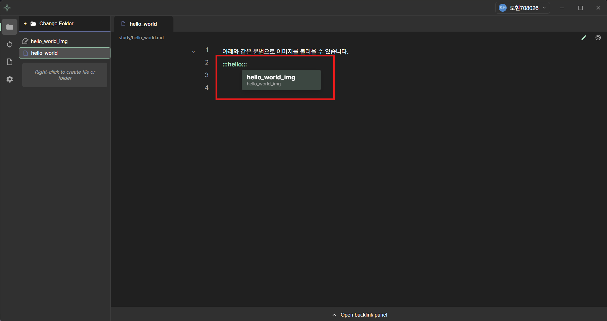
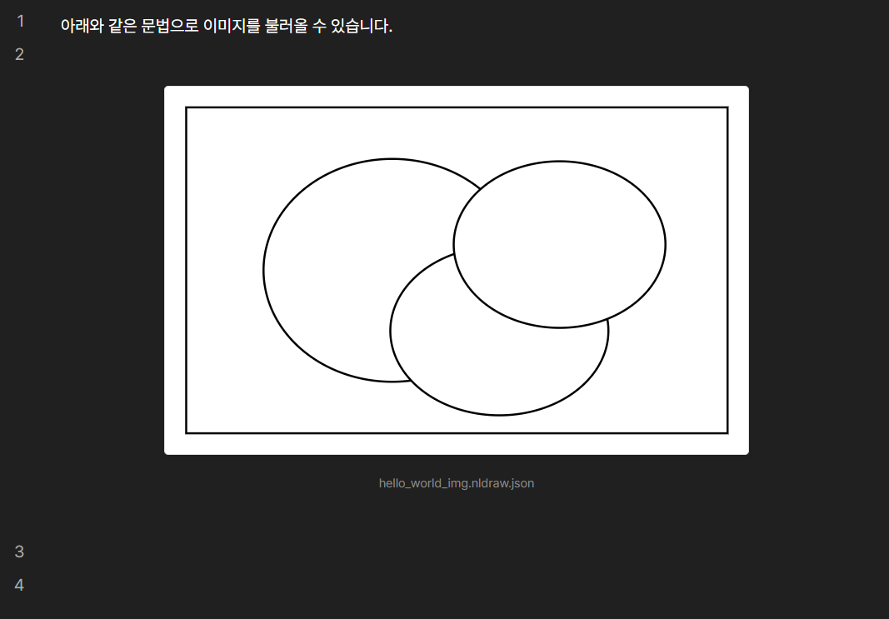
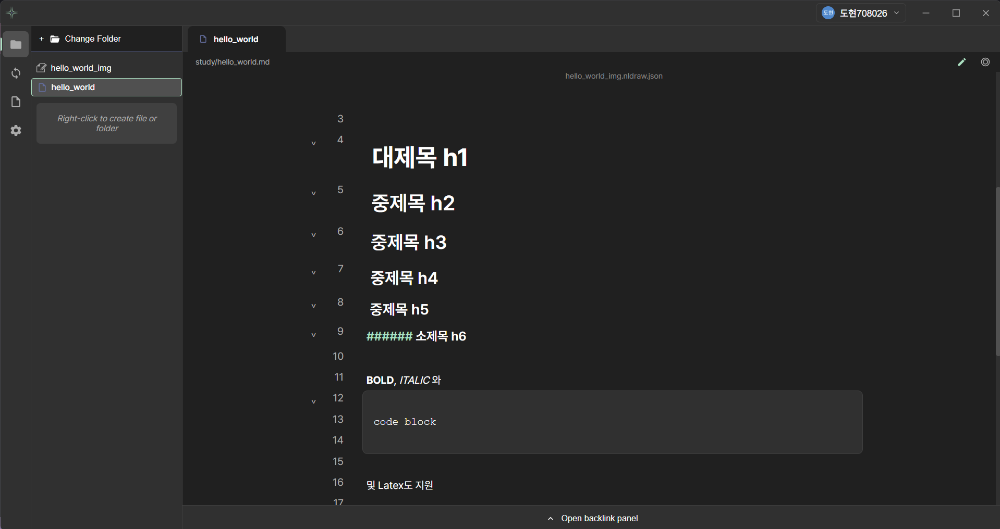
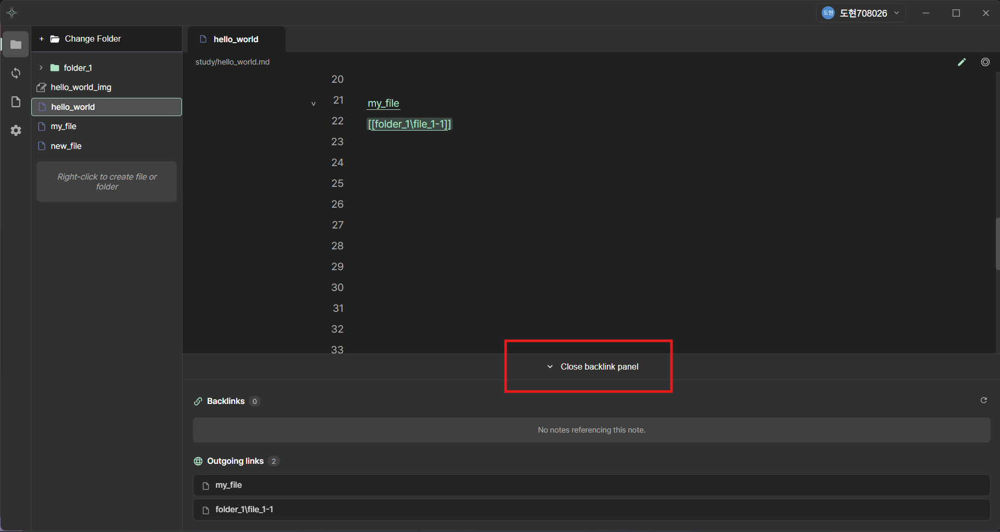
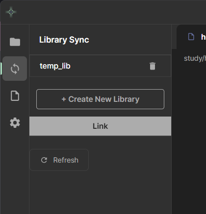
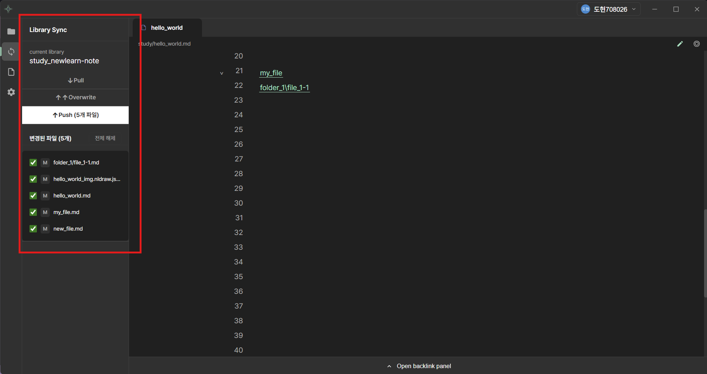
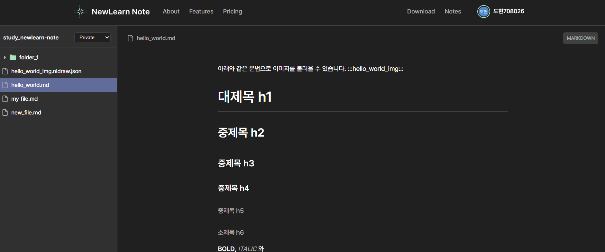
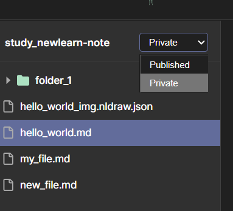

# NewLearnNote Scenario

## 1. Start NewLearnNote

[NewLearn Note 다운로드](https://newlearnnote.github.io/downloads/demo) 페이지에서 앱을 다운로드 할 수 있습니다. 회원가입 없이 설치할 수 있으며, 회원 비회원 모두 앱을 통해서 로컬에서 md 파일 등을 수정할 수 있는 **Markdown Editor 어플리케이션** 입니다.

> [NewLearn Note Documents](https://newlearnnote.github.io)에서 NewLearn Note에 대해 더 자세히 알 수 있습니다.

## 2. SignIn NewLearnNote

구글 계정 또는 이메일로 회원가입을 할 수 있으며, 회원과 비회원 모두 기본 서비스를 시작할 수 있습니다. 기본 서비스의 경우 Markdown 파일 에디터 기능만 제공합니다. (무료)회원은 기본적으로 최대 2개의 라이브러리를 생성할 수 있으며 **하나의 라이브러리의 최대 저장 공간은 500MB**입니다.(2개 합 1GB)

유료 회원의 경우 요금제마다 다른 저장 공간과 AI 활용 권한이 주어집니다.(구현 예정)

## 3. Open Folder

사용자는 왼쪽 상단의 **Add Folder 버튼**을 클릭하여 작업을 진행할 폴더를 선택할 수 있습니다.

폴더를 선택하게 되면 Add Folder 버튼은 **Change Folder** 버튼으로 바뀌게 되며 언제든지 작업 폴더를 변경할 수 있습니다.

또한 사이드바 우클릭을 통해서 markdown 파일 또는 빈 폴더를 생성할 수 있습니다. New Drawing은 현재 개발 진행 중이며, json 파일로 그림을 그릴 수 있는 에디터이고, markdown 파일에서 `:::` 문법을 활용하여 그림을 불러올 수 있습니다.

## 4. Write Markdown

위와 같이 h1에서 h6까지의 제목을 제공하며 Bold, Italic, Code Block, Latex 수학식 등 다양한 마크다운 편집 문법 기능을 제공합니다.

또한 위 이미지처럼 아웃링크(`[[file.md]]`)를 통해서 다른 파일에 바로 접근할 수 있습니다. 아웃링크 설정 시 프로젝트 루트 기준 파일 경로를 입력해야 합니다. 

즉, `file_1-1`을 아웃링크로 연결할 때는 `[[folder_1/file_1-1.md]]` 문법을 활용해서 연결할 수 있습니다. 전체 경로를 입력하기 번거롭기 때문에 위 이미지처럼 자동완성 기능을 추가하였고, 현재 이 기능을 최적화하는 단계입니다.

연결된 아웃링크/백링크를 한 번에 보고 싶다면 아래에 있는 패널 슬라이드 버튼을 클릭하면 됩니다.

## 5. Create Library

회원의 경우 라이브러리를 생성하여 파일을 저장할 수 있습니다. 깃허브 Repository와 유사한 기능으로 파일을 언제든지 저장하고 다시 다운로드 할 수 있으며, 브라우저 웹에서도 업로드한 파일들을 볼 수 있습니다.

왼쪽 사이드바에서 위에서 두 번째 버튼을 클릭해줍니다. 자신의 기존 라이브러리 리스트와 Create New Library 버튼 그리고 Link 버튼을 확인할 수 있습니다. Create New Library 버튼을 누르면 아래와 같이 라이브러리 이름을 입력하고, 라이브러리를 생성할 수 있는 버튼이 생기게 됩니다.

## 6. Link Library

`5. Create Library`의 첫 번째 이미지에서 Library List 중 하나를 선택하여 Link 버튼을 클릭하면 `5. Create Library`의 마지막 이미지처럼 연결된 상태의 UI가 보여집니다.

## 7. Pull/Push/Overwrite

라이브러리가 생성되고 연결이 된다면, 아래 이미지처럼 Pull, Push, Overwrite 세 개의 버튼이 보이게 됩니다. 

Pull 버튼을 클릭한다면, 라이브러리의 저장된 파일과 폴더를 가져오고 **다운로드하는 메커니즘**이기에, 라이브러리에 없고, 로컬에 있는 파일이 삭제되지는 않습니다(삭제 상태가 그대로 덮어씌워지지 않음). 하지만 수정된 파일을 push하지 않고, pull한 경우 라이브러리에 저장된 상태 그대로 덮어씌워지게 됩니다.

또한 Push 버튼 아래에 업로드할 수 있는 파일 목록이 뜨게 됩니다. 업로드할 수 있는 파일 목록은 마지막 Push 시점부터 지금까지 변경된 파일들입니다. 해당 버튼을 클릭하면 선택된 파일들만 라이브러리에 업로드됩니다.

**Overwrite 버튼**은 로컬 폴더 구조 그대로 라이브러리에 덮어씌우게 됩니다.

이렇게 라이브러리에 업로드된 파일은 Link와 Pull을 통해 다른 작업 환경에서 기존과 똑같은 작업 환경을 만드는데 도움을 주는 클라우드 서비스와 동일합니다.

추가로 위 이미지처럼 앱을 사용할 수 없을 때, 웹 브라우저에서 라이브러리에 존재하는 파일을 조회할 수 있습니다.

또한 위 이미지에서 아래와 같이 Private이 적힌 select를 볼 수 있습니다.

라이브러리는 **Private**과 **Published** 두 개의 공간으로 나뉘어져 있습니다. 이는 깃허브의 branch와 형태는 유사하지만, 목적과 사용 방식이 다릅니다.

### Private과 Published의 차이

**Private 공간**
- 로컬에서 작업한 모든 파일이 저장되는 개인 작업 공간입니다
- Push/Pull/Overwrite를 통해 로컬 디렉토리 구조를 그대로 동기화합니다
- 작성 중인 초안, 개인 메모, 아직 완성되지 않은 내용이 보관됩니다
- **오직 본인만 접근 가능**하며, 다른 사용자는 볼 수 없습니다

**Published 공간**
- Private에서 선택적으로 발행(Publish)한 완성된 노트만 저장되는 공개 공간입니다
- 다른 사용자들과 공유하고 싶은 지식, 정리된 학습 자료를 발행합니다
- 발행된 노트는 **다른 사용자가 검색하고 참조**할 수 있습니다
- 커뮤니티의 집단지성 네트워크를 구성하는 핵심 공간입니다

### 왜 두 공간으로 나눴나요?

1. **프라이버시 보호**: 작업 중인 미완성 내용이나 개인적인 메모는 숨기고, 공유하고 싶은 완성된 지식만 선택적으로 공개할 수 있습니다.

2. **지식 품질 관리**: 사용자가 직접 검증하고 정리한 내용만 Published로 발행하므로, 커뮤니티에 공유되는 지식의 품질이 자연스럽게 향상됩니다.

3. **부담 없는 학습**: Private 공간에서 자유롭게 실험하고 시행착오를 거치며, 자신감이 생긴 내용만 Published로 공유할 수 있습니다.

Published 공간의 자세한 사용 방법은 `8. Note Publish`에서 설명합니다.

## 8. Note Publish

Published 브랜치에 접근하면 처음에는 아래 이미지와 같이 아무런 노트도 찾을 수 없습니다.

이는 노트를 Publish하지 않았기 때문입니다. 파일을 라이브러리에 push하게 되면 private 브랜치에 저장이 되는데, private에 있는 파일을 editor에서 열게 되면 아래와 같이 publish 버튼이 있는 것을 확인할 수 있습니다.

노트를 pulish하게 되면 published 브랜치에 private 브랜치에서 해당 파일의 path를 그대로 복사하여 붙여넣습니다.

예를 들어 private 브랜치에 `folder1/file1.md`를 publish 할 경우 published 브랜치에 `folder1/file1.md`를 그대로 복사합니다. 그리고 DB에 note 데이터를 저장합니다.

이 note 데이터를 활용해서 사용자는 자신의 파일에 다른 사용자의 publish 된 노트를 `notes/:noteId` url로 연결하여 참조할 수 있습니다.

사용자는 자신의 파일에 특정 내용을 작성하며 공부할 수 있고, 추천 시스템은 현재 사용자가 작성중인 주제를 파악하여 다른 사용자가 작성한 노트에서 관련된 주제의 노트를 사용자에게 보여줍니다.

또한 직접 검색할 수 있으며, 사용자는 다른 사용자의 노트를 참조하고 연결함으로써 노트 네트워크가 형성됩니다.