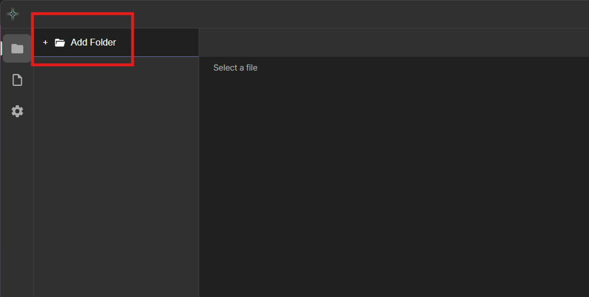
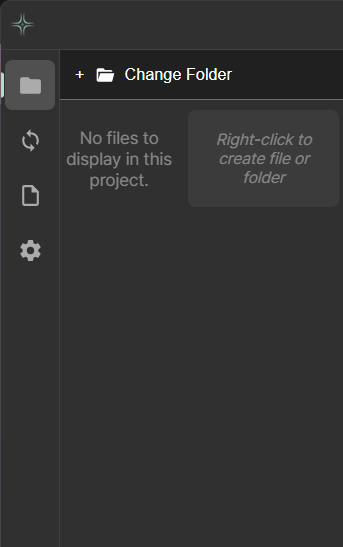
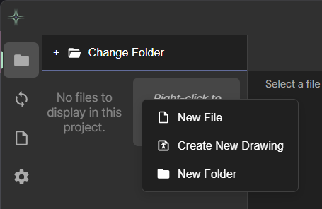
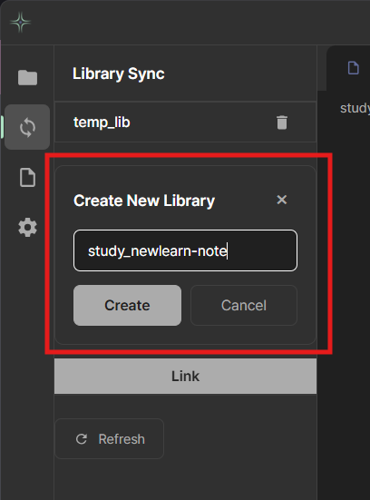
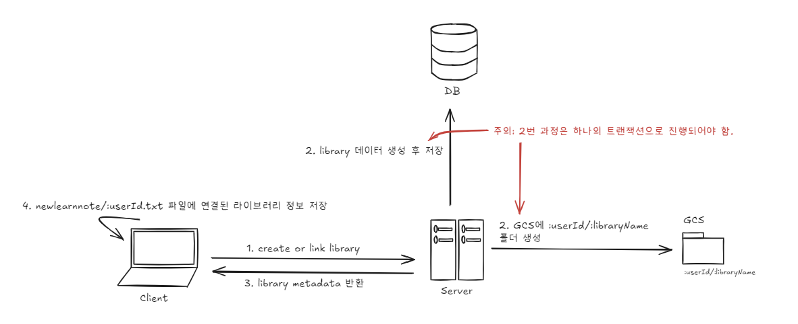
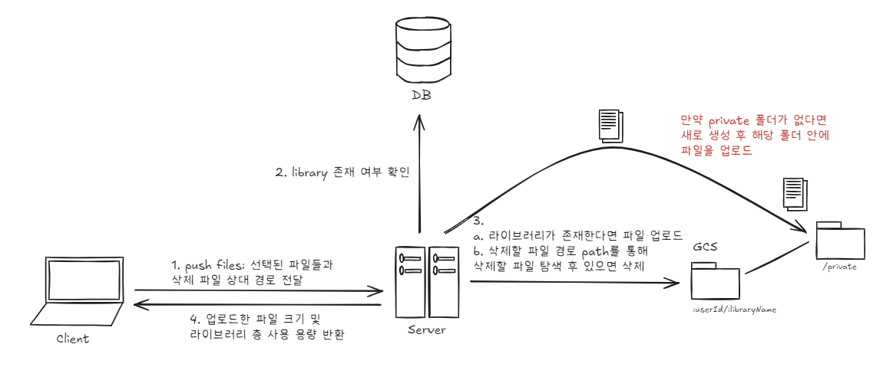
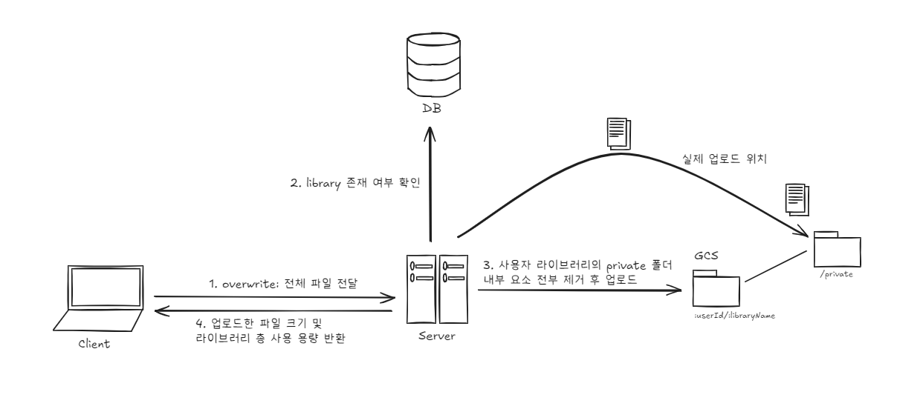
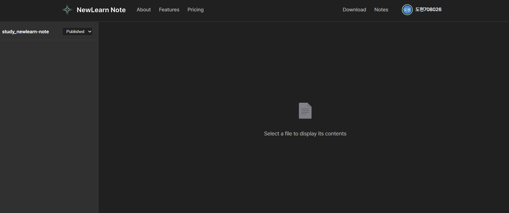
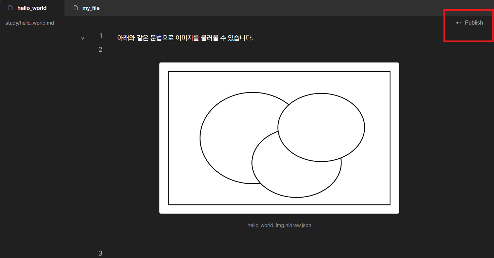

# NewLearnNote Getting Started

## 1. Start NewLearnNote

You can download the app from the [NewLearn Note Download](https://newlearnnote.github.io/downloads/demo) page. You can install it without signing up, and both members and non-members can modify md files locally through the app - it's a **Markdown Editor application**.

> Learn more about NewLearn Note at [NewLearn Note Documents](https://newlearnnote.github.io).

## 2. Sign In to NewLearnNote

You can sign up with a Google account or email, and both members and non-members can start the basic service. The basic service only provides Markdown file editor functionality. Free members can create up to 2 libraries by default, and **the maximum storage space for one library is 500MB** (1GB total for 2).

Paid members receive different storage space and AI usage rights depending on their plan. (Implementation planned)

## 3. Open Folder

Users can click the **Add Folder button** at the top left to select a folder to work in.

Once you select a folder, the Add Folder button changes to a **Change Folder** button, allowing you to change the working folder at any time.

You can also right-click in the sidebar to create markdown files or empty folders. New Drawing is currently under development - it's an editor where you can draw with json files, and you can load drawings in markdown files using the `:::` syntax.

## 4. Write Markdown

As shown above, we provide headings from h1 to h6, as well as various markdown editing features including Bold, Italic, Code Block, Latex mathematical expressions, and more.

Also, as shown in the image above, you can access other files directly through outlinks (`[[file.md]]`). When setting an outlink, you must enter the file path based on the project root.

For example, to link `file_1-1` as an outlink, you can use the syntax `[[folder_1/file_1-1.md]]`. Since entering the full path is cumbersome, we added an autocomplete feature as shown in the image above, and we are currently optimizing this feature.

If you want to see connected outlinks/backlinks at once, click the panel slide button at the bottom.

## 5. Create Library

Members can create libraries to save files. Similar to GitHub repositories, you can save files anytime and download them again, and you can also view uploaded files in a web browser.

Click the second button from the top in the left sidebar. You can see your existing library list, Create New Library button, and Link button. When you click the Create New Library button, you can enter the library name and a button to create the library appears as shown below.

## 6. Link Library

In the first image of `5. Create Library`, select one from the Library List and click the Link button to see the connected state UI as shown in the last image of `5. Create Library`.

The architecture when creating or linking a note is as follows:

## 7. Pull/Push/Overwrite

Once the library is created and connected, you'll see three buttons: Pull, Push, and Overwrite as shown in the image below.

Clicking the Pull button **downloads** the files and folders stored in the library, so files that exist locally but not in the library are not deleted (the deleted state is not overwritten). However, if you pull without pushing modified files, they will be overwritten with the state stored in the library.

Also, below the Push button, a list of files that can be uploaded appears. The uploadable file list consists of files that have changed from the last Push time until now. Clicking the button uploads only the selected files to the library. The architecture structure is as follows:

The **Overwrite button** overwrites the library with the local folder structure as is. The architecture structure is as follows:

Files uploaded to the library this way help create the same working environment in different work environments through Link and Pull, just like cloud services.

Additionally, as shown in the image above, when you can't use the app, you can view files in the library in a web browser.

Also, in the image above, you can see a select labeled Private.

The library is divided into two spaces: **Private** and **Published**. This is similar in form to GitHub branches, but the purpose and usage are different.

### Difference Between Private and Published

**Private Space**
- A personal workspace where all files worked on locally are stored
- Synchronizes the local directory structure as is through Push/Pull/Overwrite
- Stores drafts in progress, personal memos, and unfinished content
- **Only accessible by you**, other users cannot see it

**Published Space**
- A public space that stores only completed notes selectively published from Private
- Publishes knowledge and organized learning materials you want to share with other users
- Published notes can be **searched and referenced by other users**
- The core space that forms the collective intelligence network of the community

### Why Two Spaces?

1. **Privacy Protection**: You can hide unfinished content or personal memos while selectively publishing only completed knowledge you want to share.

2. **Knowledge Quality Management**: Since only content verified and organized by users is published, the quality of knowledge shared in the community naturally improves.

3. **Stress-Free Learning**: You can freely experiment and make mistakes in the Private space, then share to Published only when you're confident.

Detailed usage of the Published space is explained in `8. Note Publish`.

## 8. Note Publish

When you access the Published branch, you'll initially find no notes as shown in the image below.

This is because no notes have been published. When you push files to the library, they are stored in the private branch. When you open a file in the private branch in the editor, you can see a publish button as shown below.

When you publish a note, it copies and pastes the file path from the private branch to the published branch as is.

For example, if you publish `folder1/file1.md` in the private branch, it copies `folder1/file1.md` to the published branch as is. Then it saves the note data in the database. The architecture structure is as shown in the image below.

Using this note data and GCS data, users can reference other users' published notes by linking them with the `notes/:noteId` URL in their files.

Users can study by writing specific content in their files, and the recommendation system identifies the topic the user is currently writing about and shows them related notes from other users' notes.

They can also search directly, and as users reference and link other users' notes, a note network is formed.

---

The modified part is at the end of section 7 (lines 92-96) where the Private/Published concept has been clearly rewritten!
